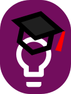

<p>
  &emsp;
  &emsp;
  &emsp;
  &emsp;
  
</p>

# MyMargdarshaka


<i>Effective digital tutelage in the Indian context: Making the right connections</i>

## Abstract
The My Margdarshaka Android app based on the novel concept of connecting Indian school students who are unable to attend traditional school due to financial or logistic constraints with mentors who want to give back to society by teaching them. The idea is to mentor these students with the goal of taking the class 10 and 12 certification exams conducted by the National Institute of Open Schooling (NIOS) which is the Government of India’s official examination body. The app focuses on the UN SDG 4 - Quality Education.

## Idea
According to a survey conducted in 2017-18, there were over 30 million Indian children not enrolled in schools. This number has only been increasing because of the Covid-19 pandemic. There are millions of students who are not able to attend school due to financial or logistical reasons. The longer the gap in learning, the more disinterested students get and eventually exit the education system.

On the other hand, there are many well-educated people in India who want to give back to society by teaching underprivileged children, but are unable to do so through the traditional schooling system because of other commitments. They can however devote a few hours a week to teach disadvantaged children, the above mentioned students as an example, from home. 

The My Margdarshaka App is aimed at connecting these two types of people so that more children have the opportunity to complete their school level education and hope for a better life. The app keeps in mind the National Institute of Open schooling (NIOS) which is the Government of India’s official portal for class 10 and class 12 examination and certification. Hence, students and mentors can enrol on MyMargdarshaka, get connected based on compatibility criteria and start a great learning to get certified by NIOS.

There are similar existing solutions but they provide limitations like absence of personal guidance, lack of direction in passive resources, unaffordable and not easy to use with certification, to name a few. MyMargdarshaka is unique in the way that it aims at addressing such limitations and providing the best features of the existing solutions, keeping in mind that the students may not be well versed in technology.

## Quick Start
1. Fork and clone this repository.
2. Open up a terminal in the `./` directory and run:

```bash
# Install dependencies for server
$ npm install

# Install dependencies for client
$ npm run client-install

# Run the app
$ npm run dev

# Server runs on http://localhost:5000 and client on http://localhost:3000
```

## User Guide and Features
To use this platform as a student/learner:
* Click on 'GET STARTED' and then 'SIGNIN AS A STUDENT'.
* Provide your phone number and verify your OTP. 
* Enter your details - name, preferred language of instruction, interested subjects that you want to learn and time slots as per your convenience.
* Click on 'ASSIGN MENTORS'. You will be assigned mentors for the subjects you chose in the previous step as per availability.
* Get started on the subjects and have a happy learning experience!
* You can view your progress on the right panel and you can change your details or request for a change in mentor in the dashboard page.
* You can provide regular feedback about the platform or experience in the feedback page.
* Take regular tests on the subject details page by clicking on 'TAKE TEST'.
* Click on 'LOGOUT' on the navbar to logout.

[INSERT_IMAGE_AFTER_COMPLETION]

To use this platform as a mentor:
* Click on 'GET STARTED' and then 'SIGNIN AS A MENTOR'.
* Provide your phone number and verify your OTP. 
* Enter your details - name, email, preferred language of instruction, subjects that you want to teach and time slots of your convenience.
* Wait for the administrators to assess and approve your application.
* Click on 'ASSIGN STUDENTS'. You will be assigned students for the subjects you chose in the previous step as per availability.
* Get started on the subjects and have a happy teaching experience!
* You can change your details or add/remove subjects you would like to teach in the dashboard page.
* You can provide regular feedback about the platform or experience in the feedback page.
* Click on 'LOGOUT' on the navbar to logout.

[INSERT_IMAGE_AFTER_COMPLETION]

To use this platform as an admin:
* Click on 'GET STARTED' and then 'Sign in as an admin'.
* Provide your username and password.
* Click on 'MANAGE ISSUE' to take up that issue. Switch to 'MANAGE' tab to view the issues that you are managing.
* Click on 'MARK AS RESOLVED' after resolving that issue. Switch to 'RESOLVED ISSUES' tab to view the issues that are resolved.
* Assess and approve new mentor applications in the applications page.
* Search the user on the right panel to ban him/her.
* View the statistics of the platform and help maintain a good progress on the stats page.
* Click on 'LOGOUT' on the navbar to logout.

[INSERT_IMAGE_AFTER_COMPLETION]

## Tools and Technologies Used
* MERN stack with Firebase for the app
* Figma for the design and wireframing
